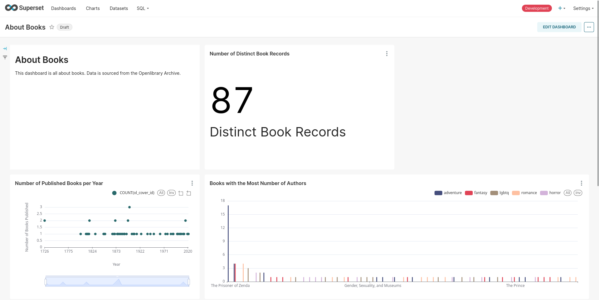
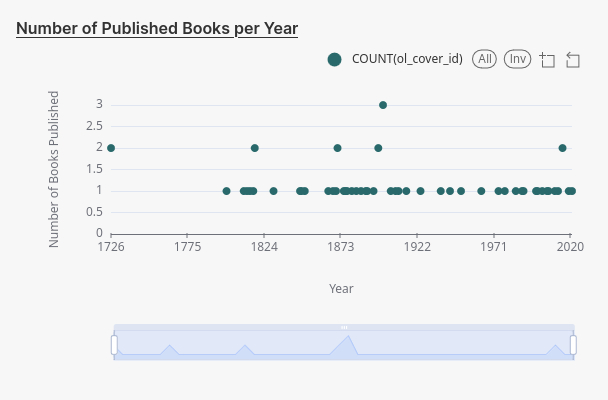
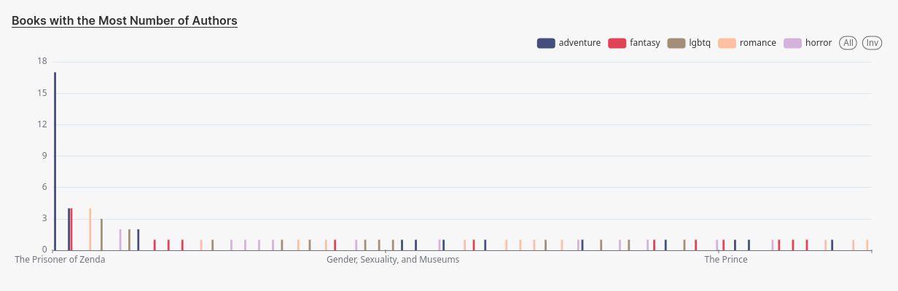
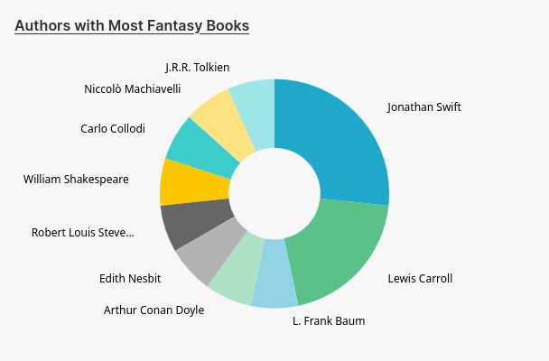

# About Books

A personal data engineering project about books. The data used in this project are sourced from the [Openlibrary API](https://openlibrary.org/developers/api).

In its current state, the project is only meant to be run in a local environment (in development mode).

## Data Pipeline

The pipeline is orchestrated by Dagster, however data visualization is excluded, which is set up such that the visualization tool is directly connecting to the data warehouse that is outputted by the pipeline.

### Data Ingestion

Both extraction and loading is powered by dlt (data load tool) where the data is sourced from Openlibrary via their API, and are loaded into DuckDB.

At the moment, the following routes are used:

- `/subjects` - used to retrieve lists of books based on a pre-defined list of subjects / genres
- `/authors` - used to retrieve author details

### Data Transformation

dbt is used for data transformation, and is meant to produce tables based on the following dimensional model:

The available data is more "catalogue-like", and the only numerical and computable figure is the `record_count`, which is not necessary, but is added for aesthetic reasons (i.e., to avoid doing a count on the table keys). In Kimball terminology, this is a factless fact table.

As can be seen, most of the analysis supported by the model are based on record counting (e.g., number of books by this author, number of books in this genre). I believe that this is due to the nature of the data source -- an archive of books -- but I'm open to the idea that further exploration of the available data may change my mind.

### Data Visualization

Apache Superset is used to make visualizations and dashboards. It directly connects to the data warehouse produced from the previous steps.

The project dashboard can be downloaded and imported to a Superset instance (export file here: [dashboard.zip](superset/dashboard.zip)).

## Sample Charts

Here are some example charts that can be found on the project dashboard.

**Number of Published Books per Year**

**Books with the Most Number of Authors**

**Authors with Most Fantasy Books**

## Future Plans

I have several options moving forward, but my priority is to make the project easily replicable via dockerization. Aside from that, here are other plans:

- Explore Openlibrary's bulk download option to get more data
- Increase data sources for more complex analysis
- Explore a lightweight data viz tool like [Evidence](https://evidence.dev/)
- Integrate cloud-based tools/services
- Build a CI/CD pipeline
